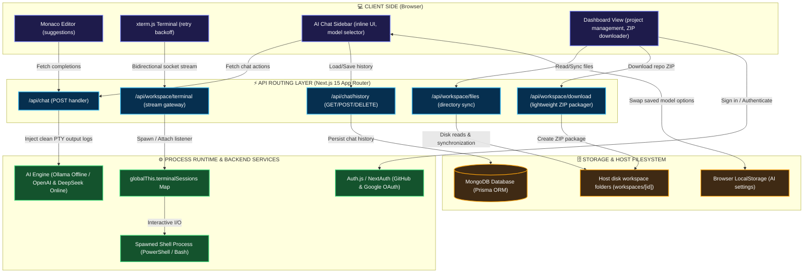

# 🚀 DevPilot — Advanced Interactive Code Playground & AI Developer IDE

DevPilot is a state-of-the-art, web-based interactive development environment (IDE) built using **Next.js 15 (Turbopack)**, **MongoDB**, and **xterm.js**. It enables developers to instantiate, edit, run, compile, and download sandboxed workspace projects with a rich vertical split-pane editor and terminal, alongside an integrated, context-aware AI Coding Assistant.

---

## 🛠️ Key Features

### 💻 1. Server-Side Code Workspaces
* **Project Templates**: Instant initialization of workspace directories (React, Express, HTML, or Blank templates) mapped directly to the local filesystem.
* **Vertical Split IDE Layout**: Resizable editor-on-top, terminal-on-bottom split screen mimicking premium desktop IDEs like VS Code.
* **Synchronized File Explorer**: High-contrast, color-coded file tree layout representing the active workspace files, updated dynamically via periodic host disk scans.

### 🔌 2. Real-Time Terminal Streaming
* **Live Shell Integration**: Shell processes (PowerShell/Bash) are spawned as server-side child processes and streamed bidirectionally to the front-end using xterm.js.
* **Background Process Control**: Supports automatic terminal cleanup. Lingering backend compilers or watchers are forcefully closed (`taskkill`) when a project is closed or deleted.
* **Robust Connection Lifecycles**: Front-end automatic retry handler with exponential backoff guarantees terminal reconnection during dev compilation or route hot-reloads.

### 🧠 3. Context-Aware AI Chat Assistant
* **Hybrid Local & Online AI Engine**: Fully compatible with both local/offline LLM runners (via Ollama) and cloud API endpoints (such as OpenAI, DeepSeek, or custom OpenAI-compatible proxies). Swaps models, keys, and base URLs dynamically.
* **Docked Side Panel**: Right-docked resizable panel featuring a modern typing card layout with model selection dropdowns.
* **Settings Binding**: Instantly retrieves and applies user-saved Ollama/OpenAI models from local settings (filtering options to user selections).
* **Terminal Error Integration**: The AI has direct, real-time access to the last 4KB of active project terminal logs. If a compiler or runtime error occurs, the assistant can immediately analyze the raw logs to diagnose issues and provide step-by-step code fixes.
* **Persistent project-scoped history**: Isolates and stores chat histories per playground ID in MongoDB (with cascade-deletion).

### 📥 4. Repository Packaging & Downloads
* **ZIP Downloader**: Client-side trigger to package and download the active workspace on demand.
* **Operational Exclusions**: Excludes heavy operational directories (like `node_modules`, `.next`, `.git`) during packaging to keep downloads lightweight.

---

## 📐 System Architecture

The following diagram illustrates how the frontend components, API endpoints, server-side processes, and databases communicate:



---

## 🧳 Technology Stack

| Layer | Technology | Key Usage / Implementation |
| :--- | :--- | :--- |
| **Framework** | Next.js 15.4.5 (Turbopack) | Dynamic routing, API routes, Turbopack compiling speed |
| **Database** | MongoDB & Prisma ORM | Stores project metadata, templates, and project-scoped AI chat histories |
| **Terminal** | xterm.js (Fit, WebLinks, Search) | Browser-based terminal rendering, command search, log extraction |
| **Auth** | Auth.js (NextAuth v5) | Multi-tenant user login via Google and GitHub OAuth providers |
| **Styling** | Tailwind CSS v4 & Radix UI | Dark-mode interface, glassmorphism headers, resizable split panes |
| **Utilities** | adm-zip, Lucide React, Zustand | Dynamic project ZIP compilation, modern icons, client-side state |

---

## ⚡ Local Setup

Follow these simple steps to run the application locally on your machine:

### 1. Prerequisites
Ensure you have Node.js (version 18 or above) and MongoDB installed. If using AI features locally, make sure Ollama is installed and running (`ollama run codellama:latest`).

### 2. Clone the Repository
```bash
git clone https://github.com/your-username/DevPilot.git
cd DevPilot
```

### 3. Setup Environment Variables
Create a `.env` file in the root directory and add the database connection string and NextAuth credentials:
```env
DATABASE_URL="mongodb+srv://<username>:<password>@<cluster>.mongodb.net/DevPilot"
NEXTAUTH_SECRET="your-nextauth-secret-key"
GITHUB_ID="your-github-oauth-id"
GITHUB_SECRET="your-github-oauth-secret"
GOOGLE_CLIENT_ID="your-google-oauth-id"
GOOGLE_CLIENT_SECRET="your-google-oauth-secret"
```

### 4. Run Database Push
Sync the database schemas and compile the Prisma client:
```bash
npx prisma db push
npx prisma generate
```

### 5. Launch the Development Server
```bash
npm run dev
```
Open [http://localhost:3000](http://localhost:3000) in your browser to view your new developer playground!

---

## 🤖 AI Configuration (Local vs. Online)

DevPilot features a dual-intelligence pipeline that adapts to your environment:

### 🔌 Option A: Local Offline AI (via Ollama)
Ideal for zero-cost, private offline development.
1. Download and run [Ollama](https://ollama.com/).
2. Pull your coding model of choice (e.g. `qwen2.5-coder:latest` or `codellama`):
   ```bash
   ollama run qwen2.5-coder:latest
   ```
3. Open the **AI Settings** dialog in DevPilot and select **Ollama** as the provider with baseUrl `http://localhost:11434`.

### 🌐 Option B: Online Cloud AI (OpenAI / DeepSeek / Custom Proxies)
Ideal for high-powered GPT-4 or DeepSeek coding performance.
1. Open the **AI Settings** dialog in DevPilot.
2. Select your provider (**OpenAI** or **DeepSeek**).
3. Input your API Key and preferred model.
4. Save settings. Swapping providers instantly re-filters dropdown selectors in the active project chat panel to your saved preferences!

